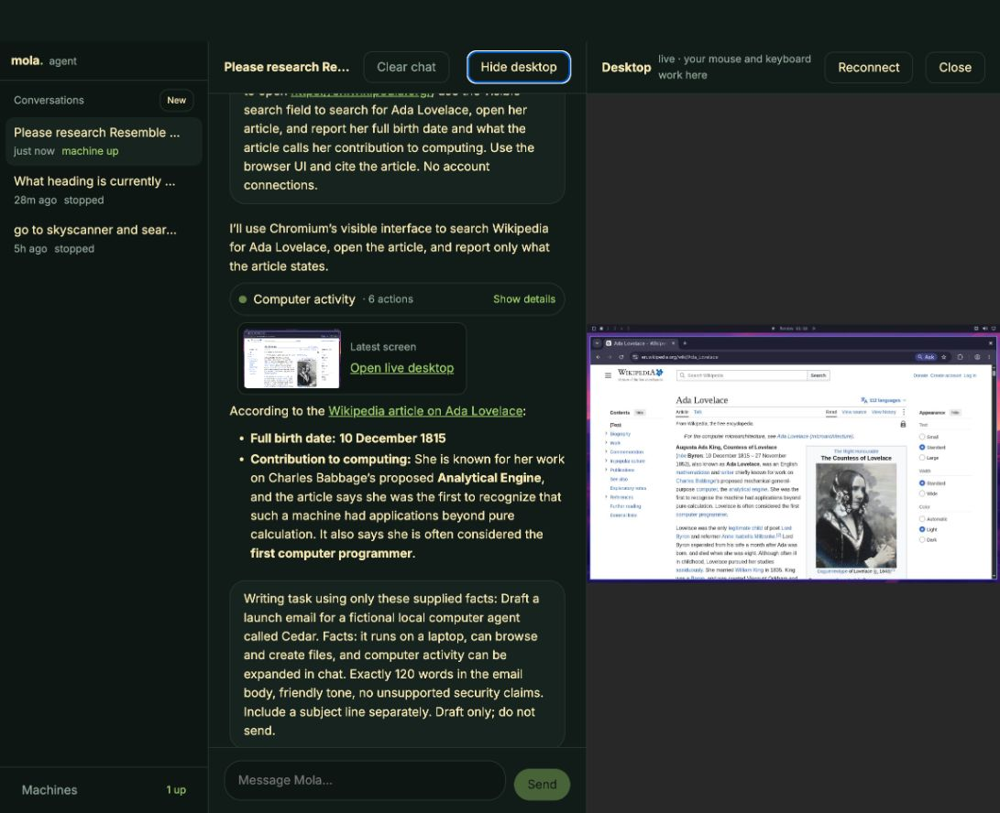

# Muse / Mola hands-on comparison

Date: September 27, 2026 (local), continued into September 28 UTC.

## Method and conclusion

Submitted seven matched, benign scenarios through logged-in Muse in Chrome and Mola at http://127.0.0.1:3939/. Mola used the existing OpenAI / gpt-5.6-luna configuration and the user's running local core. Tested the actual chat, inspected tool activity and browser previews, checked sources, and retrieved Mola's exported file bytes. No purchases, messages to others, or new account connections were requested.

Mola can handle this sample of research, browser interaction, writing, arithmetic, file generation, and follow-up editing. Testing exposed infrastructure failures that were fixed and retested. Travel planning remains a partial result because completion did not ensure factual and timing consistency. This small exercise does not establish Muse parity or a general success rate; it used one example per scenario and corrective retries.

| Scenario | Muse observed result | Mola observed result |
| --- | --- | --- |
| Browser baseline | Correct Example Domain heading; expandable browser preview | Correct heading; Markdown rendered; same machine retained after clearing |
| Official product/pricing research | Correct chat summary; research artifact produced | Passed after memory, provider and screenshot fixes; 27-action browser run |
| Sales analysis + CSV | Correct arithmetic; actual CSV preview inspected; download menu present | Arithmetic passed; initial download failed; real attachment delivered after export fix |
| Follow-up sales edit | Correct revised totals; revised CSV card produced | Correct totals and independently checked revised attachment bytes |
| Toronto travel plan | Useful complete inline itinerary and budget; minor date caveat | Partial: complete plan, but inconsistent timing and an unverified alert |
| Exactly 120-word draft | Passed independent body count after prioritization follow-up | Initial 119 words; final retest exactly 120 |
| Wikipedia visible search | Completed browser card and correct cited answer | Passed in six GUI actions with correct cited answer |

## Scenarios and verification

### 1. Browser baseline and chat rendering

Asked both agents to use the computer browser to open example.com and report the heading. Both returned `Example Domain`. Mola rendered requested bold text, lists and inline code. Its clear-chat UI was exercised: messages cleared while the conversation ID and computer remained the same. The subsequent task used that computer.

### 2. Official-site research

Prompt: research Resemble AI using its official website; summarize main products and current pricing in a compact table with source links; distinguish published pricing from contact-sales plans; no signup or app connections.

Both final chat summaries matched the current product families and subscription tiers on the [official pricing page](https://www.resemble.ai/pricing) and [product overview](https://www.resemble.ai/products/). Mola's sampled audio/image/video processing rates also matched. It rendered three Markdown tables and completed a 27-action Chromium run after the fixes below.

Muse produced a completed research artifact card. The controller lost access to its artifact viewer, so the full artifact was not independently inspected. Its chat summary was verified. A fresh temporary Muse tab allowed the remaining tests to proceed; the user's original tab was preserved.

### 3. Arithmetic and actual file delivery

Input: Alpha, 3 units at $19.99; Beta, 2 at $45.50; Alpha, 1 at $19.99; Gamma, 5 at $7.25. Aggregate revenue by product, verify arithmetic, identify the leader, and create a downloadable CSV.

Expected and observed in both chats: Alpha $79.96, Beta $91.00, Gamma $36.25, 11 total units, $207.21 total revenue, Beta highest.

Muse's actual CSV preview contained the expected rows, including the total. Its Download menu was present, but the download observer timed out: a completed local download is not claimed.

Mola initially invented a `sandbox:` link, which was unusable. Added `export_file`, persisted conversation-scoped attachments, and a real download endpoint. The retest returned HTTP 200 with an attachment filename and exact verified CSV bytes, including the 11-unit total. Downloads remain visible outside collapsed activity.

### 4. Follow-up context and file revision

Prompt: add one more Beta unit at the same price; update the summary; verify the new total and unit count; attach a revised CSV.

Both chats returned Beta $136.50, 12 total units, $252.71 grand total. Muse produced a revised CSV card, but its revised bytes were not independently inspected. Mola's revised bytes were checked: five actual newline-delimited CSV records with correct values. Its earlier immutable attachment remained available.

### 5. Seasonal travel research

Prompt: two-day car-free Toronto first visit for two adults, October 10–11, 2026; ROM and Toronto Islands only if schedules allow; official opening/transport information; uncertainties, practical itinerary and rough CAD attraction/transit budget; no booking.

Muse provided the full itinerary and CAD 283.14 itemized budget inline after a follow-up, working around artifact-viewer access. Its itinerary included extra CN Tower/Ripley's attractions. Museum hours, fall ferry season, and day-pass price agreed with [ROM visitor information](https://www.rom.on.ca/visit/visitor-information), the [City ferry schedule](https://www.toronto.ca/explore-enjoy/toronto-island-ferries/ferry-routes-schedules/), and [TTC fares](https://www.ttc.ca/Fares-and-passes). It flagged variable pricing, holiday queues and weather. Minor caveat: it mentioned a ROM closure without making clear that the published end date, October 2, precedes this trip.

Mola completed 36 browser actions and provided two days, official links and an approximately CAD 108–145 attraction/transit budget for two. It included fewer paid attractions, so the two budgets are not directly comparable. It correctly interpreted the ROM closure end date and supported pedestrian ferry feasibility.

Mola remains a **partial pass**: its optional ROM visit extends to 6 p.m. despite its stated 5:30 p.m. closing; a walking-direction description is confused; and a precise October 2–14 vehicle-ferry suspension lacks a specific supporting link. That notice was not found on the independently checked official schedules or [vehicle information](https://www.toronto.ca/explore-enjoy/toronto-island-ferries/commercial-emergency-vehicles/). Added general instructions to verify itinerary timing and cite specific supporting pages. A second travel run was not performed, so the instruction change is not a demonstrated travel fix.

### 6. Constrained writing

Prompt: draft a friendly launch email for fictional Cedar using only these supplied facts: runs on a laptop, can browse/create files, computer activity expands in chat. Exactly 120 body words; subject separately; no unsupported security claims; draft only.

Muse met the 120-word constraint after a prioritization follow-up while its travel artifact occupied it. Mola's first draft had 119 body words. Added general constraint-verification guidance, rebuilt/restarted Mola, then repeated the same task. The final draft had **exactly 120 words** by an independent whitespace count, including salutation/sign-off and excluding the subject. No email was sent. Mola did not call a counting script in that retest, so consistent programmatic self-verification is not established.

### 7. Actual browser interaction

Prompt: open English Wikipedia, use its visible search field to search Ada Lovelace, open the article, report her full birth date and the article's description of her computing contribution, cite the article; no connections.

Both passed: 10 December 1815 and the Analytical Engine / first-computer-programmer description with an article link. Mola's trace showed six actions: reuse Chromium, screenshot, click search, type, Enter, fresh screenshot. The live desktop showed the article. No shell substitute, login or page edits.

## Changes made during testing

- Compact expandable activity, latest-screen preview, clear working state, visible approvals and attachments; proper Markdown tables/lists/code and links.
- Clear messages while retaining the conversation, computer and files; loading and busy-send guards; responsive chat/desktop columns and wrapped controls.
- Chromium reuse: focus an existing window and navigate its current tab. Support current Hyprland Lua focus dispatch with a legacy fallback. No extra window unless required.
- Correct screenshot geometry: actually resize the image to 1024×640, scale input coordinates using native dimensions, reject out-of-image input at execution time, and retain compatibility with historical conversations.
- Provider transport: isolated Undici HTTP/1.1 fetch resolved observed Node 26 TLS/HTTP2 streaming failures. An initial built-in-fetch/dispatcher mismatch was corrected. Errors now appear in chat with a Continue task action.
- Real file export: conversation-scoped storage, safe filenames, 10 MB limit, actual download response, clear retention and delete cleanup. Model results contain metadata rather than file bytes.
- General guidance to verify exact counts, arithmetic, sources and itinerary timing.

## Validation and remaining limits

Build and standalone bundle passed. **26/26 automated tests passed**, including packaged installation/startup, route protections, clearing with computer retention, attachment bytes/scope/retention, screenshot conversion and browser reuse. An initial parallel packaging rebuild invalidated route-test chunks; packaging now tests the already-built artifact without rerunning prepack. Normal publishing prepack still builds/bundles. `git diff --check` passed.

Desktop layout was checked at 1400, 1000, 800 and 400 px: chat/desktop panes stayed within their columns; smaller views stacked. Live observation confirmed **one Chromium window** after successive research tasks. The final build is running at http://127.0.0.1:3939/; Mola core was left running.

Two simultaneous 4 GB VMs exhausted the native host action-memory budget. Stopping an older idle test VM, retaining its disk, allowed testing to proceed. This resource limit remains. Longer GUI runs were slow with the configured model. Only the configured OpenAI provider was live-tested. Email/calendar connectors, purchases, PDF/slide creation, and broader multi-step benchmarks were not tested.

