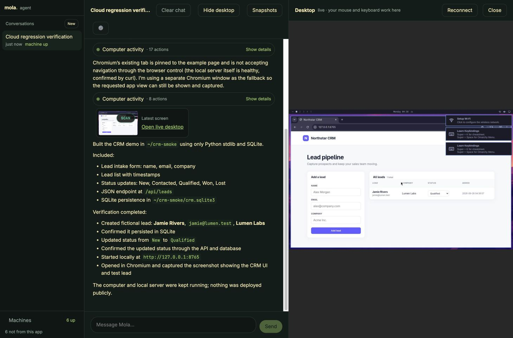

# Cloud regression verification — 1.1.3

Tested against the real Mola Cloud API on 2026-09-27, using an isolated test computer and a private copy of the configured Agent settings.

## Original failure

The API creates a computer with `{ data: computer, operation }`. The client dropped the envelope, then the backend accessed `result.data.id`. List endpoints also returned resource arrays that the client treated as named object properties, so every retry created another computer.

## Checks completed

- Create through the actual `run_command` agent tool; operation reaches `succeeded`, then the refreshed computer is ready.
- Run a shell command; confirm Linux and installed Chromium.
- Write/read a file, stop the computer, resume through an agent tool, and read the retained file on the same computer ID.
- Launch Chromium and capture a real screenshot through Sharp.
- Real configured OpenAI model: run command, read file and screenshot through the production chat endpoint, with no tool or stream errors and unchanged computer ID.
- Embedded noVNC desktop connects through the loopback relay and remains connected after the grant's 60-second expiry.
- CRM task entered in the browser chat: create a Python stdlib + SQLite CRM, add a fictional lead, update its status, verify API/database persistence, and display the CRM in Chromium. No public deployment was requested for this test.
- Automated Cloud response contract and relay rejection tests run alongside the existing launcher, packaging, chat, screenshot and conversation suites.

Cloud deployment/provisioning, the real model, desktop and guest automation were exercised. This does not claim that arbitrary website hosting or CRM production security has been verified.
